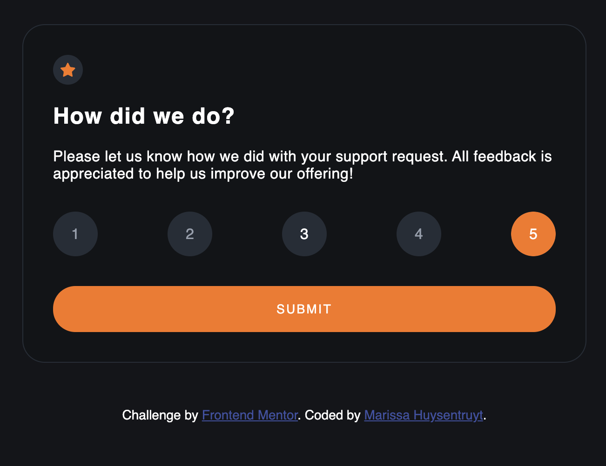

# Frontend Mentor - Interactive rating component solution

This is a solution to the [Interactive rating component challenge on Frontend Mentor](https://www.frontendmentor.io/challenges/interactive-rating-component-koxpeBUmI). Frontend Mentor challenges help you improve your coding skills by building realistic projects. 

## Table of contents

- [Welcome & Overview](#welcome-👋)
  - [The challenge](#the-challenge)
  - [Where to find everything](#where-to-find-everything)
  - [Running the Project](#running-the-project)
  - [Deploying the Project](#deploying-the-project)
  - [Screenshot](#screenshot)
  - [Links](#links)
- [My process](#my-process)
  - [Built with](#built-with)
  - [What I learned](#what-i-learned)
  - [Continued development](#continued-development)
  - [Useful resources](#useful-resources)
- [Author](#author)

**To do this challenge, you need a basic understanding of HTML, CSS and JavaScript.**

## Welcome 👋
This coding challenge is an interactive rating component. There are 2 basic cards- the user input card, and the submission card. On the user input card, users should be able to select a rating from 1 to 5, and once they submit their rating, the submission card appears, verifying the rating they submitted.

### The challenge

Besides creating a project that looks as close to the designs as possible, users should be able to:

- View the optimal layout for the app depending on their device's screen size
- See hover states for all interactive elements on the page
- Select and submit a number rating
- See the "Thank you" card state after submitting a rating

### Where to find everything

If you would like to see the static design files, you may find them in the `design` folder. You'll see both a mobile and a desktop version.

There is also a `style-guide.md` file containing the information regarding the designs, such as color palette and fonts.

### Running the project

There's not active development server for this project, so you'll have to pull the `index.html` file found in the `dist` directory into your browser, make changes, run `npm run build` to compile the SCSS & minify the JS, and refresh the browser in order to see your changes.

In order to get all dependencies for the project, make sure to run `npm install`.
### Deploying the project

There are many ways to host your project for free. Recommended hosts are:

- [GitHub Pages](https://pages.github.com/)
- [Vercel](https://vercel.com/)
- [Netlify](https://www.netlify.com/)

You can see this deployed version via Netlify [here](https://main--sprightly-clafoutis-8a7b72.netlify.app/).

### Screenshot

### Links

- Solution URL: [First Solution](https://www.frontendmentor.io/solutions/interactive-rating-component-PK0JV1uQr4)
- Live Site URL: [Live Site](https://main--sprightly-clafoutis-8a7b72.netlify.app/)

## My process
I first started with the HTML, getting things in a more semantic place (although not really accessible). Then, because I knew I wanted to use SCSS, I had to do some research on how to hook SCSS up to my `index.html` file, and created a little script to do that (`compile:sass`). Finally, I wrote the JavaScript. 

At this point, I wanted to try to deploy this site to Netlify. It seemed too easy at first, and once the site built for the first time, I panicked because none of my styles were there. After remembering that SCSS doesn't mean anything to a browser, which can only read CSS, I was stumped on how to get my SCSS to work during deployments. With some more searching, I found a mention of Webpack, and realized I probably needed something to help compile my SCSS to CSS once my project was on Netlify. Sure enough, once I figured out how to configure Webpack, my deploys were all styled.

### Built with

- Semantic HTML5 markup
- SCSS
- ITCSS
- Webpack
- BEM naming practice
- CSS Custom Properties
- Flexbox
- Mobile-first workflow

### What I learned

The most exciting thing I took away from this project was being able to get Webpack working! 🥳 With the help of the Webpack docs, I actually understand what the `webpack.config.js` file is doing and saying!

Additionally, I created a `package.json` file with dependencies for the first time! I knew some of the technologies I wanted to work with, had to do some research, had to do extra reading, but I now have a project that uses more tech and languages at once than I've ever built on my own!

### Continued development

My remaining ideas for this project would be to:
- introduce a feature to somehow clear the selected rating, without just choosing a different rating 
- introduce an animation of the card when the submit button is clicked

### Useful resources

As a someone who stills considers themselves quite new to development, I found the [Webpack docs](https://webpack.js.org/concepts/) to be quite readable. I didn't really understand why Webpack was needed, and I've never tried to use Webpack on my own. By following the documetation, however, I was able to read and understand all I needed in order to get Webpack to work and build this site. 

## Author

- Website - [Marissa Huysentruyt](https://www.marissahuysentruyt.com)
- Frontend Mentor - [@marissahuysentruyt](https://www.frontendmentor.io/profile/marissahuysentruyt)
